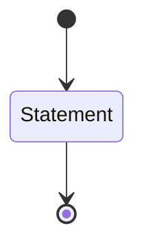
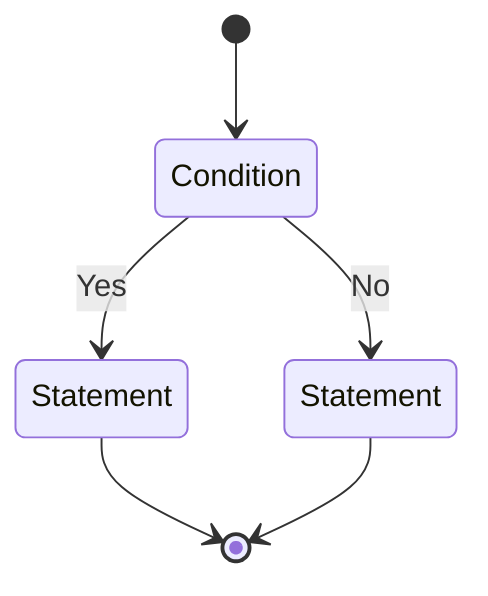
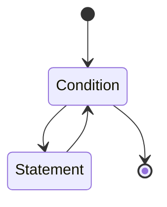
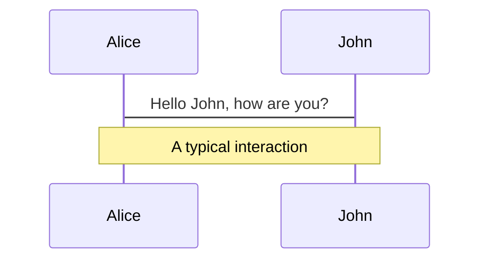
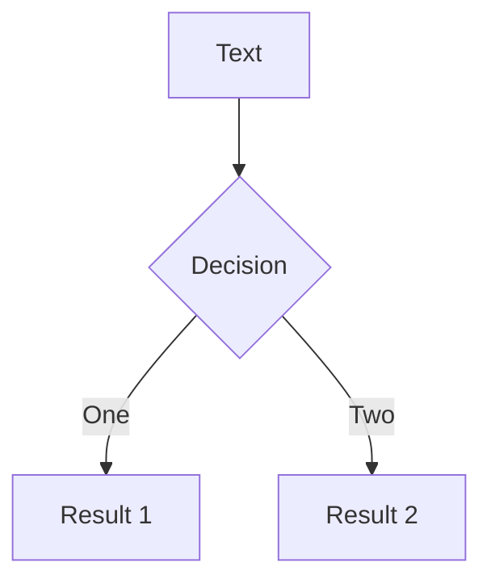
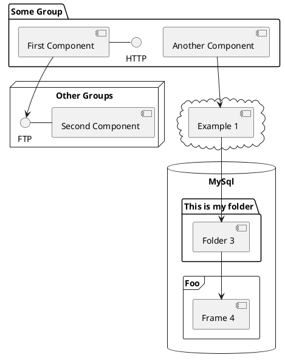

---
# try also 'default' to start simple
theme: seriph
# random image from a curated Unsplash collection by Anthony
# like them? see https://unsplash.com/collections/94734566/slidev
background: https://source.unsplash.com/collection/94734566/1920x1080
# apply any windi css classes to the current slide
class: 'text-center'
# https://sli.dev/custom/highlighters.html
highlighter: shiki
# show line numbers in code blocks
lineNumbers: false
# some information about the slides, markdown enabled
info: |
  ## Slidev Starter Template
  Presentation slides for developers.

  Learn more at [Sli.dev](https://sli.dev)
# persist drawings in exports and build
drawings:
  persist: false
# use UnoCSS (experimental)
css: unocss
---

# Structured Concurrency

<!-- <qrCode text="https://skoppe.github.io/dconf-2022"/> -->

insert title

<!--
This section is an introduction and sets the playing field
- you must have heard about moore's law
- its dead
- instead of faster cpus, we get more of them
- the challenge is to make use of these extra cores
- one thing that is for sure is that it is rather difficult
-->

---

# All views expressed herein are my owner

---

# Microprocessor Trend Data

<div class="h-full flex justify-center -mt-4">

</div>

<!--

Note the frequency levelling off and the number of cores increasing

in order to benefit we can't rely on frequency increase, but have to start utilizing those extra cores

-->

---
class: 'flex flex-col h-full'
---

# Parellism vs Concurrency

<div class="flex h-full place-content-around">
  <div class="flex flex-col">
    <div class="flex">
      <mdi-arrow-down-thin class="text-3xl w-12"/>
      <div class="w-2"></div>
      <mdi-arrow-down-thin class="text-3xl w-12"/>
    </div>
    <div class="flex flex-row h-full">
      <div class="bg-green-500 w-12"></div>
      <div class="w-2"></div>
      <div class="bg-yellow-500 w-12"></div>
    </div>
  </div>
  <div class="flex flex-col">
    <mdi-arrow-down-thin class="text-3xl w-12"/>
    <div class="flex flex-col h-full">
      <div class="bg-green-500 w-12 flex-grow"></div>
      <div class="bg-yellow-500 w-12 flex-grow"></div>
      <div class="bg-green-500 w-12 flex-grow"></div>
      <div class="bg-yellow-500 w-12 flex-grow"></div>
    </div>
  </div>
</div>


<!--
Here we set the stage by what we mean with concurrency
and how parallelism is a subset of concurrency

- parallelism is the effort of speeding up a computation by splitting it into isolated pieces and running them across different execution contexts (threads, processes, gpus, clusters, etc.)
- the hard part of parallism is finding those isolated pieces
- concurrency is the effort of interleaving many tasks over fewer execution contexts, with the effort of increasing utilisation by performing other work while one task is waiting

-->

---
class: 'flex flex-col h-full'
---

# Different ways to paint a house

```mermaid {scale: 1.0, theme: 'forest'}
gantt
    dateFormat HH:mm
    axisFormat %H:%M
    todayMarker off
    section Sequential
    Paint rooms      :a1, 10:00, 6hours
    section Parallel
    Paint room 1     :a2, 10:00, 2hours
    Paint room 2     :a2, 10:00, 2hours
    Paint room 3     :a2, 10:00, 2hours
    section Concurrent
    Paint room 1 first    :a3, 10:00, 30min
    Paint room 2 first    :a4, 10:30, 30min
    Paint room 3 first    :a5, 11:00, 30min
    Paint room 1 second    :a3, 11:30, 30min
    Paint room 2 second    :a4, 12:00, 30min
    Paint room 3 second    :a5, 12:30, 30min
```

<div class="overflow-x-scroll overflow-y-hidden">

</div>

<!--

sequential - just one guy painting his house
parallel - realizing there are 3 rooms, I get 2 extra friends to help. If rooms are of equal size, then we complete roughly 3 times as fast.
concurreny - realizing that each room needs 2 layers of paint and that there is waiting involved. After the first layer of room 1, I go to room 2, room 3, and back to room 1 to apply the second layer, same with rooms 2 and 3.

the 2 is the fastest, but the 3rd has a higher utilisation and doesn't take as much time.

The concurrent one is only possible because of the waiting involved. If a task doesn't have any waits, then you can't run it concurrently, but have to run it in parallel instead.

Another thing to look at is the increasing complexity of managing things. In the parallel case it is still straightforward - just a simple fork+join - but in the concurrent approach, we need to keep track of more tasks and the dependecies between them.

Which leads me into the next slide.

-->

---

# Bugs

- Data races
- Deadlock 
- Livelock 
- Starvation 
- Order violation 
- Atomicity violation

[Understanding Real-World Concurrency Bugs in Go](https://songlh.github.io/paper/go-study.pdf)  
[A Comprehensive Study on Real World Concurrency
Bugs in Node.js](https://dl.acm.org/doi/pdf/10.5555/3155562.3155628)  
[A Study of Concurrency Bugs and Advanced
Development Support for Actor-based Programs](https://arxiv.org/pdf/1706.07372.pdf)  
[JaConTeBe: A Benchmark Suite of Real-World Java
Concurrency Bugs](https://mir.cs.illinois.edu/marinov/publications/LinETAL15JaConTeBe.pdf)  
[Data Race Patterns in Go](https://eng.uber.com/data-race-patterns-in-go/)  


<!--

plenty of bugs

-->

---

# Concurrency in D
The usual suspects

<div class="flex">
<div class="w-1/2">
<ul>
<li>core.Thread</li>
<li>std.concurrency.spawn</li>
<li>std.parallelism.task / taskPool</li>
<li>vibe.d.runTask</li>
<li>etc.</li>
</ul>
</div>
<div class="w-1/2">

```d
auto fun() {
    return spawn(...);
}

void gun() {
    auto task = fun();
    // ...
    join(task);
}
```
</div>
</div>

---

# Concurrency in D
The usual suspects

<div class="flex">
<div class="w-1/2">
<ul>
<li>core.Thread</li>
<li>std.concurrency.spawn</li>
<li>std.parallelism.task / taskPool</li>
<li>vibe.d.runTask</li>
<li>etc.</li>
</ul>
</div>
<div class="w-1/2">

```d
auto fun() {
    return new ...;
}

void gun() {
    auto task = fun();
    // ...
    delete task;
}
```
</div>
</div>

<!--
How does that make you feel?

We have unknowingly been using an API similar to the one we use in Manaul Memory Management.

What is actually the problem with new and delete?

"you forget the delete."

Well that is more a symptom. The problem is that with Manual Memory Management is the fact we split up the resource into two pieces , put one here, and the other there, with nothing but an invisible link between them, that you can only see if you analyse the code inbetween.

Looking at each one in isolation gives you no insight into the other.

In order to know *where* to put the delete, you have to understand a lot more than the surroundings of whereever you end up putting it. You need to examine everything from new to delete.

The problem isn't that you forget the delete, the problem is that it isn't clear where to put it. And even if you put it somewhere, it isn't clear that its correct.

With concurrency we have a similar problem, that we end up splitting the spawn and the join, requiring non-local context to reason about the whole thing.

The problem is that it doesn't scale. The moment your software gets larger there is too much to remain aware of.

-->
---

# Concurrency in D
Is unstructured

- fire-and-forget
- unclear ownership
- unclear lifetime
- error handling is hard
- what about cancellation
- non composable

<!--

spawning things is way easier that correctly managing them.  
it isn't clear who owns what  
the lifetime of a concurrent task isn't know, not even relative to something else.  
error handling is something the user has to built itself  
cancellation is left as an "exercise for the reader"  
nothing about it is composable  

It actually resembles unstructured programming a lot.
-->

---
class: 'flex flex-col h-full'
---

# Unstructured Programming
<i>from https://vorpus.org/blog/notes-on-structured-concurrency-or-go-statement-considered-harmful/</i>


---
class: 'flex flex-col h-full'
---

# Unstructured Programming
<i>from https://vorpus.org/blog/notes-on-structured-concurrency-or-go-statement-considered-harmful/</i>


---
class: 'flex flex-col h-full'
---

# Unstructured Programming
<i>from https://vorpus.org/blog/notes-on-structured-concurrency-or-go-statement-considered-harmful/</i>


---

# Increasing complexity

<div class="shadow bg-gray-100 p-4 m-4 dark:bg-gray-700">
<mdi-format-quote-open />
[...] many people working in the area of computing have expressed concern with the problem of software reliability.
While the cost of hardware has decreased as power has increased, software costs have increased and become more complex. The result is that, although we can do more than before, it is at the risk of encountering more serious problems than before, and the problems usually prove to be more resistant to solution. In response to this situation, several approaches to programming have been devised to make programs more reliable and, at the same time, boost the amount of relatively bug-free code a programmer can produce.
<mdi-format-quote-close />
<span class="block text-right mt-4">
Except from "An introduction to structured programming" by Karl P. Hunt. 1979
</span>
</div>


<!-- - started in the 60's when software was becoming bigger and people needed a way to deal with the complexity

This quote is actually very late. Structured programming started much earlier but there was quite some debate and back-and-forth
-->


---

# Structured Program Theorem
[Böhm66] Corrado Böhm, Giuseppe Jacopini, ‘Flow Diagrams, Turing Machines and Languages With only Two Formation Rules’, http://citeseerx.ist.psu.edu/viewdoc/download?doi=10.1.1.119.9119&rep=rep1&type=pdf, Communication of the ACM, May, 1966

<div class="flex self-start">

<div class="bg-white w-1/3 text-black items-center flex flex-col">
Sequence

</div>

<div class="bg-white w-1/3 text-black items-center flex flex-col">
Selecting

</div>

<div class="bg-white w-1/3 text-black items-center flex flex-col">
Iteration

</div>
</div>


<!---
- uses 3 construct to deals with any programming problem: sequence, selection and iteration
- use of abstractions as building blocks (both in code and data)
- recursive decomposition of the program as a method of creation/analysis of a program
- local reasoning helps understandability, and scope nesting is a good way of achieving local reasoning
- after some initial opposition, eventually everyone agreed it was better overall
- it is hard to find an unstructured programming language
- maybe we have become so accustomed to it that we are blind to unstructured programming

- The hierachy of modules
each module controls those immediately below it. To say a module controls another means that it initiates the action of the other, and that the other module returns control to the first when it is finished.

Top-down we have decomposition, bottom-up we have composition. With that we have a structured way to chop up problems into smaller ones, or compose solutions out of smaller ones.

Composition allows to compose code. We don't have composition with concurrency. We can write a function that retries another function max n times. A for loop, a counter, error handling, and forwarding the error when its retried too often. But doing this with an concurrent function requires a lot of DIY. This is because there is no standard way to call a concurrent function, so we have no way to compose them. This means there are no async algorithms readily available, so people code what they need, with all the bugs that that ensues.
-->

---

# Structured Programming

<div class="shadow bg-gray-100 p-4 m-4 dark:bg-gray-700">
<mdi-format-quote-open />
The ability to check each module independently is
an obvious advantage of SP. In general, the clarity and
systematic nature of the lines of control and the
independence of the modules are responsible for
the superiority of SP over a more unorganized approach.
It is much easier to tell when a module is being
performed in a structured program, as there is only one
way of getting into it and only one way of getting out,
and both the entry and exit connect to the same higher
level module. Thus, the logic is more easily followed
both within and between modules
<mdi-format-quote-close />
<span class="block text-right mt-4">
Except from "An introduction to structured programming" by Karl P. Hunt. 1979
</span>
</div>

<!--

Lets examine what happens if we apply the principles of structured programming to concurrency.

But before that, lets look at the cornerstone of concurrency: the asynchronous function.

-->

---

# Asynchronous Functions

|   | **regular functions** | **asynchronous function** |
|---|----------------|-----------------------|
| parameters        | <mdi-check-bold class="text-green-600"/> | <mdi-check-bold class="text-green-600"/>     |
| return value      | <mdi-check-bold class="text-green-600"/> | <mdi-check-bold class="text-green-600"/>   |
| exception         | <mdi-check-bold class="text-green-600"/> | <mdi-check-bold class="text-green-600"/>      |
| execution         | inline | runs *somewhere* else |
| cancellable       | <mdi-close class="text-red-600"/> | <mdi-check-bold class="text-green-600"/>         |
| owner             | caller           | <mdi-help class="text-yellow-600"/> |
| lifetime          | less than caller      | <mdi-help class="text-yellow-600"/> |

---

# Asynchronous Functions
Fire and forget...


<!--
Well, it is a function, but its asynchronous. What does that mean, for a function to be asynchronous.

Let us first look at a function. It has input, output, maybe it can throw an exception. Async functions need to do all that too, plus they have to be asynchronous.

The simplest exlpanation of asynchrony that I can come up with is that the asynchronous function *runs* somewhere else. Not on the calling stack. It might be on another thread, or one the same thread, just not a top of stack frame of the caller.

Basically we want to call a function that can outlive our stack frame.

But this kills pretty much all the lifetime and ownership guarantees we had from structured programming.

Yet this is exactly what we want, we want to run something on a separate or disjoint execution context, which one we don't care much about, as long as the calling function can continue.
-->

---

# Structured Concurrency
Ownership and lifetime

<div class="flex flex-row">
<div class="w-1/2">
- Every async function needs to have a owner<br>
- An owner needs to outlive all the async functions it owns

Just like with structured programming, one entry, one exit, all encapsulated in one block

This means we need to set the continuation before we start the async work.

##### <span class="text-gray-400">Error handling and cancellation</span>

Because there is always an owner, there is always a place to forward errors to.

Because each async function has a owner, cancellation naturally flows from the owner to the async function.


- An error in an async functions must naturally bubble up to its owner
</div>
<div class="w-1/2">
<div class="flex flex-col items-center">


from https://blog.softwaremill.com/structured-concurrency-and-pure-functions-92dd8ed1a9f2
</div>
</div>
</div>

<!-- It allows control flow to remain readily evident by the structure of the source code despite the presence of concurrency.
-->

---

# C++'s P2300
std::execution

<dl>
<dt class="font-bold">Authors:
</dt><dd class="pl-4 p-author h-card vcard"><a class="p-name fn u-email email" href="mailto:griwes@griwes.info">Michał Dominiak</a>
</dd><dd class="pl-4 p-author h-card vcard"><a class="p-name fn u-email email" href="mailto:evtushenko.georgy@gmail.com">Georgy Evtushenko</a>
</dd><dd class="pl-4 p-author h-card vcard"><a class="p-name fn u-email email" href="mailto:lewissbaker@gmail.com">Lewis Baker</a>
</dd><dd class="pl-4 p-author h-card vcard"><a class="p-name fn u-email email" href="mailto:lucteo@lucteo.ro">Lucian Radu Teodorescu</a>
</dd><dd class="pl-4 p-author h-card vcard"><a class="p-name fn u-email email" href="mailto:xrikcus@gmail.com">Lee Howes</a>
</dd><dd class="pl-4 p-author h-card vcard"><a class="p-name fn u-email email" href="mailto:kirk.shoop@gmail.com">Kirk Shoop</a>
</dd><dd class="pl-4 p-author h-card vcard"><a class="p-name fn u-email email" href="mailto:mgarland@nvidia.com">Michael Garland</a>
</dd><dd class="pl-4 p-author h-card vcard"><a class="p-name fn u-email email" href="mailto:eric.niebler@gmail.com">Eric Niebler</a>
</dd><dd class="pl-4 p-author h-card vcard"><a class="p-name fn u-email email" href="mailto:brycelelbach@gmail.com">Bryce Adelstein Lelbach</a>
</dd><dt class="font-bold">Source:
</dt><dd class="pl-4"><a href="https://github.com/brycelelbach/wg21_p2300_std_execution/blob/main/std_execution.bs">GitHub</a>
</dd><dt class="font-bold">Project:
</dt><dd class="pl-4">ISO/IEC JTC1/SC22/WG21 14882: Programming Language — C++
</dd><dt class="font-bold">Audience:
</dt><dd class="pl-4">SG1, LEWG
</dd>
</dl>

---

# C++'s P2300

<div class="shadow bg-gray-100 p-4 m-4 dark:bg-gray-700">
<mdi-format-quote-open />
Today, C++ software is increasingly asynchronous and parallel, a trend that is likely to only continue going forward. Asynchrony and parallelism appears everywhere, from processor hardware interfaces, to networking, to file I/O, to GUIs, to accelerators. Every C++ domain and every platform needs to deal with asynchrony and parallelism, from scientific computing to video games to financial services, from the smallest mobile devices to your laptop to GPUs in the world’s fastest supercomputer.

While the C++ Standard Library has a rich set of concurrency primitives (std::atomic, std::mutex, std::counting_semaphore, etc) and lower level building blocks (std::thread, etc), **we lack a Standard vocabulary and framework for asynchrony and parallelism** that C++ programmers desperately need. std::async/std::future/std::promise, C++11’s intended exposure for asynchrony, is inefficient, hard to use correctly, and severely lacking in genericity, making it unusable in many contexts. We introduced parallel algorithms to the C++ Standard Library in C++17, and while they are an excellent start, they are all inherently synchronous and not composable.

This paper proposes a Standard C++ model for asynchrony, based around three key abstractions: **schedulers, senders, and receivers**, and a set of **customizable asynchronous algorithms**.<mdi-format-quote-close />
</div>

<!--

The biggest thing missing here is **structured**. "We lack a structured framework for asynchrony".

I won't go into much detail on how sender/receivers work, but we will discuss some example code that uses them, and convince you that it follows all of the structured concurrency principles we talked about.

-->

---

# Sender/Receivers
A basic sender

```d
/// A Sender that sends a single value of type T
struct ValueSender(T) {
  alias Value = T;
  T value;
  static struct Op(Receiver) {
    Receiver receiver;
    T value;
    void start() @safe nothrow {
      receiver.setValue(value);
    }
  }
  auto connect(Receiver)(return Receiver receiver) @safe scope return {
    // ensure NVRO
    auto op = Op!(Receiver)(receiver, value);
    return op;
  }
}
```

<!--

A ValueSender just sends one value.

As you can see the 'Sender' here is just a struct with a single value. It takes up no more space than the value itself. It requires no allocations. 

-->

---

# Sender/Receivers
Use syncWait to start and await the Sender

```d
auto just(T t) @safe {
  return ValueSender!T(t);
}

void main() {
  just(42).syncWait();
}
```

---

# Senders/Receivers
whenAll algorithm

```d
auto someFooSender() { /* ... */ }
auto someBarSender() { /* ... */ }

void foobar() {
    whenAll(someFooSender, someBarSender)
        .syncWait(); // what ought to happen if either `someFooSender` or `someBarSender` fails?
}
```

<div v-click>
How about in structured programming:
```d
auto foo() { /* ... */ }
auto bar() { /* ... */ }

void foobar() {
    foo(); // what happens if this one fails? lets say it throws an Exception
    bar();
}
```
</div>

<!--

Lets look a bit at structured programming.

Think back about the statement earlier that an owner must always outlive everything it owns.

in this case `whenAll` owns both someFooSender and someBarSender, it cannot complete until both of them are.

If one of them errors, there is little value in the other one, and `whenAll` has to complete as well, forwaring the error. But not until it first cancelled and awaited the someBarSender. 

-->

---

# Senders/Receivers
retry algorithm

```d
auto someFooSender() { /* ... */ }
auto someBarSender() { /* ... */ }

void foobar() {
    whenAll(someFooSender.retry(MaxTimes(3)), someBarSender)
        .syncWait(); // What ought to happen if `someBarSender` fails?
}
```

---

# Senders/Receivers
race algorithm

```d
auto someFooSender() { /* ... */ }
auto someBarSender() { /* ... */ }

auto foobar() {
    return whenAll(someFooSender.retry(MaxTimes(3)), someBarSender);
}

void fun() {
    race(foobar(), delay(10.secs))
        .syncWait();
}
```

---

# Narrow Waist

---

# BYOA

---

# Streams

---

# No-sync / no-lock task graphs

---

# Future

---

# Welcome to Slidev

Presentation slides for developers

<div class="pt-12">
  <span @click="$slidev.nav.next" class="px-2 py-1 rounded cursor-pointer" hover="bg-white bg-opacity-10">
    Press Space for next page <carbon:arrow-right class="inline"/>
  </span>
</div>

<div class="abs-br m-6 flex gap-2">
  <button @click="$slidev.nav.openInEditor()" title="Open in Editor" class="text-xl icon-btn opacity-50 !border-none !hover:text-white">
    <carbon:edit />
  </button>
  <a href="https://github.com/slidevjs/slidev" target="_blank" alt="GitHub"
    class="text-xl icon-btn opacity-50 !border-none !hover:text-white">
    <carbon-logo-github />
  </a>
</div>

<!--
The last comment block of each slide will be treated as slide notes. It will be visible and editable in Presenter Mode along with the slide. [Read more in the docs](https://sli.dev/guide/syntax.html#notes)
-->

---

# What is Slidev?

Slidev is a slides maker and presenter designed for developers, consist of the following features

- 📝 **Text-based** - focus on the content with Markdown, and then style them later
- 🎨 **Themable** - theme can be shared and used with npm packages
- 🧑‍💻 **Developer Friendly** - code highlighting, live coding with autocompletion
- 🤹 **Interactive** - embedding Vue components to enhance your expressions
- 🎥 **Recording** - built-in recording and camera view
- 📤 **Portable** - export into PDF, PNGs, or even a hostable SPA
- 🛠 **Hackable** - anything possible on a webpage

<br>
<br>

Read more about [Why Slidev?](https://sli.dev/guide/why)

<!--
You can have `style` tag in markdown to override the style for the current page.
Learn more: https://sli.dev/guide/syntax#embedded-styles
-->

<style>
h1 {
  background-color: #2B90B6;
  background-image: linear-gradient(45deg, #4EC5D4 10%, #146b8c 20%);
  background-size: 100%;
  -webkit-background-clip: text;
  -moz-background-clip: text;
  -webkit-text-fill-color: transparent;
  -moz-text-fill-color: transparent;
}
</style>

---

# Navigation

Hover on the bottom-left corner to see the navigation's controls panel, [learn more](https://sli.dev/guide/navigation.html)

### Keyboard Shortcuts

|     |     |
| --- | --- |
| <kbd>right</kbd> / <kbd>space</kbd>| next animation or slide |
| <kbd>left</kbd>  / <kbd>shift</kbd><kbd>space</kbd> | previous animation or slide |
| <kbd>up</kbd> | previous slide |
| <kbd>down</kbd> | next slide |

<!-- https://sli.dev/guide/animations.html#click-animations -->

<p v-after class="absolute bottom-23 left-45 opacity-30 transform -rotate-10">Here!</p>

---
layout: image-right
image: https://source.unsplash.com/collection/94734566/1920x1080
---

# Code

Use code snippets and get the highlighting directly![^1]

```ts {all|2|1-6|9|all}
interface User {
  id: number
  firstName: string
  lastName: string
  role: string
}

function updateUser(id: number, update: User) {
  const user = getUser(id)
  const newUser = { ...user, ...update }
  saveUser(id, newUser)
}
```

<arrow v-click="3" x1="400" y1="420" x2="230" y2="330" color="#564" width="3" arrowSize="1" />

[^1]: [Learn More](https://sli.dev/guide/syntax.html#line-highlighting)

<style>
.footnotes-sep {
  @apply mt-20 opacity-10;
}
.footnotes {
  @apply text-sm opacity-75;
}
.footnote-backref {
  display: none;
}
</style>

---

# Components

<div grid="~ cols-2 gap-4">
<div>

You can use Vue components directly inside your slides.

We have provided a few built-in components like `<Tweet/>` and `<Youtube/>` that you can use directly. And adding your custom components is also super easy.

```html
<Counter :count="10" />
```

<!-- ./components/Counter.vue -->
<Counter :count="10" m="t-4" />

Check out [the guides](https://sli.dev/builtin/components.html) for more.

</div>
<div>

```html
<Tweet id="1390115482657726468" />
```

<Tweet id="1390115482657726468" scale="0.65" />

</div>
</div>


---
class: px-20
---

# Themes

Slidev comes with powerful theming support. Themes can provide styles, layouts, components, or even configurations for tools. Switching between themes by just **one edit** in your frontmatter:

<div grid="~ cols-2 gap-2" m="-t-2">

```yaml
---
theme: default
---
```

```yaml
---
theme: seriph
---
```


</div>

Read more about [How to use a theme](https://sli.dev/themes/use.html) and
check out the [Awesome Themes Gallery](https://sli.dev/themes/gallery.html).

---
preload: false
---

# Animations

Animations are powered by [@vueuse/motion](https://motion.vueuse.org/).

```html
<div
  v-motion
  :initial="{ x: -80 }"
  :enter="{ x: 0 }">
  Slidev
</div>
```

<div class="w-60 relative mt-6">
  <div class="relative w-40 h-40">
    
    
    
  </div>

  <div
    class="text-5xl absolute top-14 left-40 text-[#2B90B6] -z-1"
    v-motion
    :initial="{ x: -80, opacity: 0}"
    :enter="{ x: 0, opacity: 1, transition: { delay: 2000, duration: 1000 } }">
    Slidev
  </div>
</div>

<!-- vue script setup scripts can be directly used in markdown, and will only affects current page -->
<script setup lang="ts">
const final = {
  x: 0,
  y: 0,
  rotate: 0,
  scale: 1,
  transition: {
    type: 'spring',
    damping: 10,
    stiffness: 20,
    mass: 2
  }
}
</script>

<div
  v-motion
  :initial="{ x:35, y: 40, opacity: 0}"
  :enter="{ y: 0, opacity: 1, transition: { delay: 3500 } }">

[Learn More](https://sli.dev/guide/animations.html#motion)

</div>

---

# LaTeX

LaTeX is supported out-of-box powered by [KaTeX](https://katex.org/).

<br>

Inline $\sqrt{3x-1}+(1+x)^2$

Block
$$
\begin{array}{c}

\nabla \times \vec{\mathbf{B}} -\, \frac1c\, \frac{\partial\vec{\mathbf{E}}}{\partial t} &
= \frac{4\pi}{c}\vec{\mathbf{j}}    \nabla \cdot \vec{\mathbf{E}} & = 4 \pi \rho \\

\nabla \times \vec{\mathbf{E}}\, +\, \frac1c\, \frac{\partial\vec{\mathbf{B}}}{\partial t} & = \vec{\mathbf{0}} \\

\nabla \cdot \vec{\mathbf{B}} & = 0

\end{array}
$$

<br>

[Learn more](https://sli.dev/guide/syntax#latex)

---

# Diagrams

You can create diagrams / graphs from textual descriptions, directly in your Markdown.

<div class="grid grid-cols-3 gap-10 pt-4 -mb-6">







</div>

[Learn More](https://sli.dev/guide/syntax.html#diagrams)


---
layout: center
class: text-center
---

# Learn More

[Documentations](https://sli.dev) · [GitHub](https://github.com/slidevjs/slidev) · [Showcases](https://sli.dev/showcases.html)
