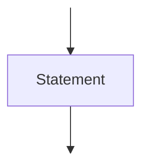
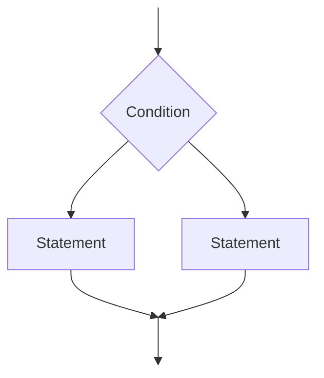
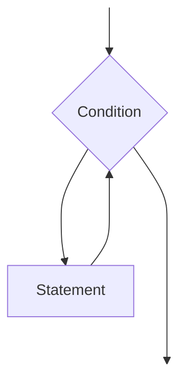
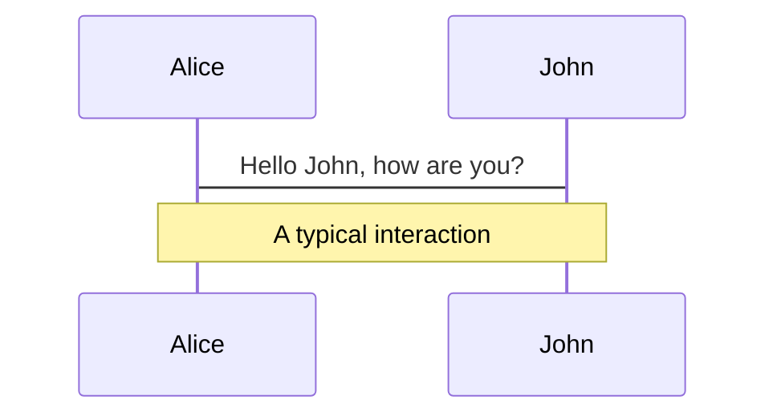
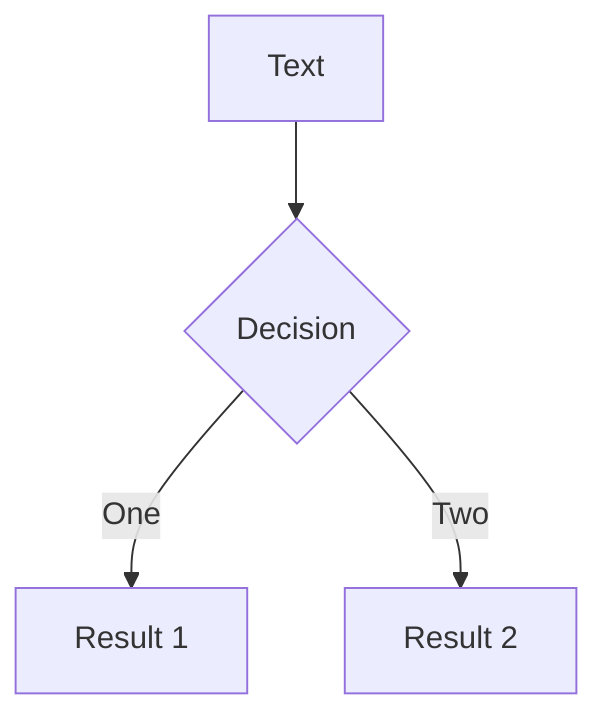
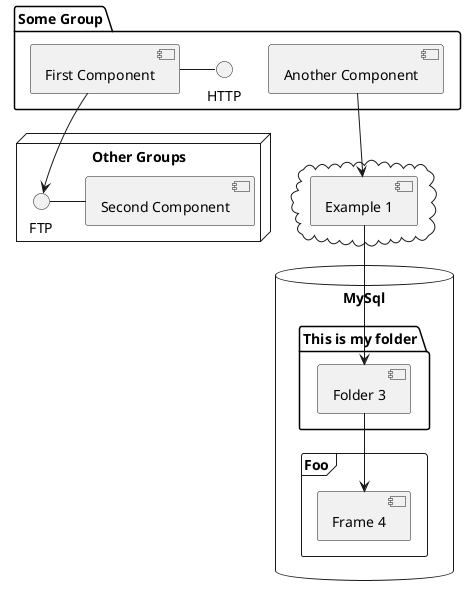

---
# try also 'default' to start simple
theme: seriph
# random image from a curated Unsplash collection by Anthony
# like them? see https://unsplash.com/collections/94734566/slidev
background: https://source.unsplash.com/collection/94734566/1920x1080
# apply any windi css classes to the current slide
class: 'text-center'
# https://sli.dev/custom/highlighters.html
highlighter: shiki
# show line numbers in code blocks
lineNumbers: false
# some information about the slides, markdown enabled
info: |
  ## Slidev Starter Template
  Presentation slides for developers.

  Learn more at [Sli.dev](https://sli.dev)
# persist drawings in exports and build
drawings:
  persist: false
# use UnoCSS (experimental)
css: unocss
---

# Structured Concurrency

insert qr code

insert title

<!--
This section is an introduction and sets the playing field
- you must have heard about moore's law
- its dead
- instead of faster cpus, we get more of them
- the challenge is to make use of these extra cores
- one thing that is for sure is that it is rather difficult
-->

---

# Parellism vs Concurrency

<!--
Here we set the stage by what we mean with concurrency
and how parallelism is a subset of concurrency

- parallelism is the effort of speeding up a computation by splitting it into isolated pieces and run them across different execution contexts (threads, processes, gpus, clusters, etc.)
- the hard part of parallism is finding those isolated pieces
- concurrency is the effort of interleaving many tasks over fewer execution contexts, with the effort of increasing utilisation by performing other work while one task is waiting

-->

---

# Different ways to paint a house

1) sequential
2) parallel
3) concurrent

---
layout: two-cols
---

<template v-slot:default>
# Bugs

- Data races
- Deadlock 
- Livelock 
- Starvation 
- Order violation 
- Atomicity violation
</template>
<template v-slot:right>
[Understanding Real-World Concurrency Bugs in Go](https://songlh.github.io/paper/go-study.pdf)
[A Comprehensive Study on Real World Concurrency
Bugs in Node.js](https://dl.acm.org/doi/pdf/10.5555/3155562.3155628)
[A Study of Concurrency Bugs and Advanced
Development Support for Actor-based Programs](https://arxiv.org/pdf/1706.07372.pdf)
[JaConTeBe: A Benchmark Suite of Real-World Java
Concurrency Bugs](https://mir.cs.illinois.edu/marinov/publications/LinETAL15JaConTeBe.pdf)
[Data Race Patterns in Go](https://eng.uber.com/data-race-patterns-in-go/)
</template>

---

# Structured Programming

---

# Structured Program Theorem

<div class="flex self-start">

<div class="bg-white w-1/3 text-black flex flex-col">
Sequence
<div class="flex-grow justify-center flex flex-col">

</div>
</div>

<div class="bg-white w-1/3 text-black">
Selecting

</div>

<div class="bg-white w-1/3 text-black">
Iteration

</div>
</div>


Top-down we have decomposition, bottom-up we have composition. With that we have a structured way to chop up problems into smaller ones, or compose solutions out of smaller ones.

Composition allows to compose code. We don't have composition with concurrency. We can write a function that retries another function max n times. A for loop, a counter, error handling, and forwarding the error when its retried too often. But doing this with an concurrent function requires a lot of DIY. This is because there is no standard way to call a concurrent function, so we have no way to compose them. This means there are no async algorithms readily available, so people code what they need, with all the bugs that that ensues.

---

# Unstructured Concurrency

- fire-and-forget
- unclear ownership
- unclear lifetime
- error handling is hard
- cancellation? DIY

This leads to a lot of bugs, that everyone seems to repeat.

---

# Asynchrony

Lets step back and look at the basic building block of concurrency. The asynchronous function.

What does it do?

Well, it is a function, but its asynchronous. What does that mean, for a function to be asynchronous.

Let us first look at a function. It has input, output, maybe it can throw an exception. Async functions need to do all that too, plus they have to be asynchronous.

The simplest exlpanation of asynchrony that I can come up with is that the asynchronous function *runs* somewhere else. Not on the calling stack. It might be on another thread, or one the same thread, just not a top of stack frame of the caller.

Basically we want to call a function that can outlive our stack frame.

But this kills pretty much all the lifetime and ownership guarantees we had from structured programming.

Yet this is exactly what we want, we want to run something on a separate or disjoint execution context, which one we don't care much about, as long as the calling function can continue.

---

# Structured Concurrency

---

# Narrow Waist

---

# BYOA

---

# Streams

---

# No-sync / no-lock task graphs

---

# Future

---

# Welcome to Slidev

Presentation slides for developers

<div class="pt-12">
  <span @click="$slidev.nav.next" class="px-2 py-1 rounded cursor-pointer" hover="bg-white bg-opacity-10">
    Press Space for next page <carbon:arrow-right class="inline"/>
  </span>
</div>

<div class="abs-br m-6 flex gap-2">
  <button @click="$slidev.nav.openInEditor()" title="Open in Editor" class="text-xl icon-btn opacity-50 !border-none !hover:text-white">
    <carbon:edit />
  </button>
  <a href="https://github.com/slidevjs/slidev" target="_blank" alt="GitHub"
    class="text-xl icon-btn opacity-50 !border-none !hover:text-white">
    <carbon-logo-github />
  </a>
</div>

<!--
The last comment block of each slide will be treated as slide notes. It will be visible and editable in Presenter Mode along with the slide. [Read more in the docs](https://sli.dev/guide/syntax.html#notes)
-->

---

# What is Slidev?

Slidev is a slides maker and presenter designed for developers, consist of the following features

- 📝 **Text-based** - focus on the content with Markdown, and then style them later
- 🎨 **Themable** - theme can be shared and used with npm packages
- 🧑‍💻 **Developer Friendly** - code highlighting, live coding with autocompletion
- 🤹 **Interactive** - embedding Vue components to enhance your expressions
- 🎥 **Recording** - built-in recording and camera view
- 📤 **Portable** - export into PDF, PNGs, or even a hostable SPA
- 🛠 **Hackable** - anything possible on a webpage

<br>
<br>

Read more about [Why Slidev?](https://sli.dev/guide/why)

<!--
You can have `style` tag in markdown to override the style for the current page.
Learn more: https://sli.dev/guide/syntax#embedded-styles
-->

<style>
h1 {
  background-color: #2B90B6;
  background-image: linear-gradient(45deg, #4EC5D4 10%, #146b8c 20%);
  background-size: 100%;
  -webkit-background-clip: text;
  -moz-background-clip: text;
  -webkit-text-fill-color: transparent;
  -moz-text-fill-color: transparent;
}
</style>

---

# Navigation

Hover on the bottom-left corner to see the navigation's controls panel, [learn more](https://sli.dev/guide/navigation.html)

### Keyboard Shortcuts

|     |     |
| --- | --- |
| <kbd>right</kbd> / <kbd>space</kbd>| next animation or slide |
| <kbd>left</kbd>  / <kbd>shift</kbd><kbd>space</kbd> | previous animation or slide |
| <kbd>up</kbd> | previous slide |
| <kbd>down</kbd> | next slide |

<!-- https://sli.dev/guide/animations.html#click-animations -->

<p v-after class="absolute bottom-23 left-45 opacity-30 transform -rotate-10">Here!</p>

---
layout: image-right
image: https://source.unsplash.com/collection/94734566/1920x1080
---

# Code

Use code snippets and get the highlighting directly![^1]

```ts {all|2|1-6|9|all}
interface User {
  id: number
  firstName: string
  lastName: string
  role: string
}

function updateUser(id: number, update: User) {
  const user = getUser(id)
  const newUser = { ...user, ...update }
  saveUser(id, newUser)
}
```

<arrow v-click="3" x1="400" y1="420" x2="230" y2="330" color="#564" width="3" arrowSize="1" />

[^1]: [Learn More](https://sli.dev/guide/syntax.html#line-highlighting)

<style>
.footnotes-sep {
  @apply mt-20 opacity-10;
}
.footnotes {
  @apply text-sm opacity-75;
}
.footnote-backref {
  display: none;
}
</style>

---

# Components

<div grid="~ cols-2 gap-4">
<div>

You can use Vue components directly inside your slides.

We have provided a few built-in components like `<Tweet/>` and `<Youtube/>` that you can use directly. And adding your custom components is also super easy.

```html
<Counter :count="10" />
```

<!-- ./components/Counter.vue -->
<Counter :count="10" m="t-4" />

Check out [the guides](https://sli.dev/builtin/components.html) for more.

</div>
<div>

```html
<Tweet id="1390115482657726468" />
```

<Tweet id="1390115482657726468" scale="0.65" />

</div>
</div>


---
class: px-20
---

# Themes

Slidev comes with powerful theming support. Themes can provide styles, layouts, components, or even configurations for tools. Switching between themes by just **one edit** in your frontmatter:

<div grid="~ cols-2 gap-2" m="-t-2">

```yaml
---
theme: default
---
```

```yaml
---
theme: seriph
---
```


</div>

Read more about [How to use a theme](https://sli.dev/themes/use.html) and
check out the [Awesome Themes Gallery](https://sli.dev/themes/gallery.html).

---
preload: false
---

# Animations

Animations are powered by [@vueuse/motion](https://motion.vueuse.org/).

```html
<div
  v-motion
  :initial="{ x: -80 }"
  :enter="{ x: 0 }">
  Slidev
</div>
```

<div class="w-60 relative mt-6">
  <div class="relative w-40 h-40">
    
    
    
  </div>

  <div
    class="text-5xl absolute top-14 left-40 text-[#2B90B6] -z-1"
    v-motion
    :initial="{ x: -80, opacity: 0}"
    :enter="{ x: 0, opacity: 1, transition: { delay: 2000, duration: 1000 } }">
    Slidev
  </div>
</div>

<!-- vue script setup scripts can be directly used in markdown, and will only affects current page -->
<script setup lang="ts">
const final = {
  x: 0,
  y: 0,
  rotate: 0,
  scale: 1,
  transition: {
    type: 'spring',
    damping: 10,
    stiffness: 20,
    mass: 2
  }
}
</script>

<div
  v-motion
  :initial="{ x:35, y: 40, opacity: 0}"
  :enter="{ y: 0, opacity: 1, transition: { delay: 3500 } }">

[Learn More](https://sli.dev/guide/animations.html#motion)

</div>

---

# LaTeX

LaTeX is supported out-of-box powered by [KaTeX](https://katex.org/).

<br>

Inline $\sqrt{3x-1}+(1+x)^2$

Block
$$
\begin{array}{c}

\nabla \times \vec{\mathbf{B}} -\, \frac1c\, \frac{\partial\vec{\mathbf{E}}}{\partial t} &
= \frac{4\pi}{c}\vec{\mathbf{j}}    \nabla \cdot \vec{\mathbf{E}} & = 4 \pi \rho \\

\nabla \times \vec{\mathbf{E}}\, +\, \frac1c\, \frac{\partial\vec{\mathbf{B}}}{\partial t} & = \vec{\mathbf{0}} \\

\nabla \cdot \vec{\mathbf{B}} & = 0

\end{array}
$$

<br>

[Learn more](https://sli.dev/guide/syntax#latex)

---

# Diagrams

You can create diagrams / graphs from textual descriptions, directly in your Markdown.

<div class="grid grid-cols-3 gap-10 pt-4 -mb-6">







</div>

[Learn More](https://sli.dev/guide/syntax.html#diagrams)


---
layout: center
class: text-center
---

# Learn More

[Documentations](https://sli.dev) · [GitHub](https://github.com/slidevjs/slidev) · [Showcases](https://sli.dev/showcases.html)
