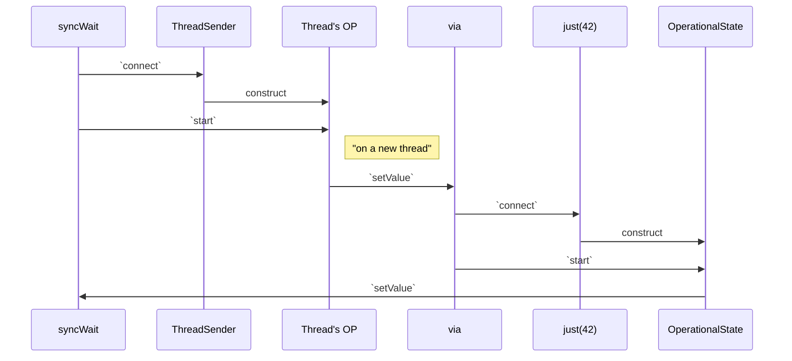

---
# try also 'default' to start simple
theme: seriph
# random image from a curated Unsplash collection by Anthony
# like them? see https://unsplash.com/collections/94734566/slidev
# apply any windi css classes to the current slide
class: 'text-center'
# https://sli.dev/custom/highlighters.html
highlighter: shiki
# show line numbers in code blocks
lineNumbers: true
# some information about the slides, markdown enabled
info: |
  Structured Concurrency in D
  What is it, how does it work and why do we need it.
# persist drawings in exports and build
drawings:
  persist: false
# use UnoCSS (experimental)
css: unocss
---

# Structured Concurrency


---
class: flex flex-col
---

# All views expressed herein are my own
https://skoppe.github.io/dconf-2022/


---

# Microprocessor Trend Data

<div class="h-full flex justify-center -mt-4">

</div>

<!--

Here is a chart for CPU trends for the last 50 years.

Note the frequency levelling off and the number of cores increasing

in order to benefit we can't rely on frequency increase, but have to start utilizing those extra cores

-->

---
class: 'flex flex-col h-full'
---

# Parellism vs Concurrency

<div class="flex h-full place-content-around">
  <div class="flex flex-col">
    <div class="flex">
      <mdi-arrow-down-thin class="text-3xl w-12"/>
      <div class="w-2"></div>
      <mdi-arrow-down-thin class="text-3xl w-12"/>
    </div>
    <div class="flex flex-row h-full">
      <div class="bg-green-500 w-12"></div>
      <div class="w-2"></div>
      <div class="bg-yellow-500 w-12"></div>
    </div>
  </div>
  <div class="flex flex-col">
    <mdi-arrow-down-thin class="text-3xl w-12"/>
    <div class="flex flex-col h-full">
      <div class="bg-green-500 w-12 flex-grow"></div>
      <div class="bg-yellow-500 w-12 flex-grow"></div>
      <div class="bg-green-500 w-12 flex-grow"></div>
      <div class="bg-yellow-500 w-12 flex-grow"></div>
    </div>
  </div>
</div>


<!--

- parallelism is the effort of speeding up a computation by splitting it into isolated pieces and running them across different execution contexts (threads, processes, gpus, clusters, etc.)
- the hard part of parallism is finding those isolated pieces
- concurrency is the effort of interleaving many tasks over fewer execution contexts, with the effort of increasing utilisation by performing other work while one task is waiting

-->

---
class: 'flex flex-col h-full'
---

# Different ways to paint a house

<div class="overflow-x-scroll overflow-y-hidden">

</div>

<!--

sequential - just one guy painting his house
parallel - realizing there are 3 rooms, I get 2 extra friends to help. If rooms are of equal size, then we complete roughly 3 times as fast.
concurreny - realizing that each room needs 2 layers of paint and that there is waiting involved. After the first layer of room 1, I go to room 2, room 3, and back to room 1 to apply the second layer, same with rooms 2 and 3.

the 2 is the fastest, but the 3rd has a higher utilisation and doesn't take as much time.

The concurrent one is only possible because of the waiting involved. If a task doesn't have any waits, then you can't run it concurrently, but have to run it in parallel instead.

Another thing to look at is the increasing complexity of managing things. In the parallel case it is still straightforward - just a simple fork+join - but in the concurrent approach, we need to keep track of more tasks and the dependecies between them.

Which leads me into the next slide.

-->

---

# Bugs

- Data races
- Deadlock 
- Livelock 
- Starvation 
- Order violation 
- Atomicity violation

[Understanding Real-World Concurrency Bugs in Go](https://songlh.github.io/paper/go-study.pdf)  
[A Comprehensive Study on Real World Concurrency
Bugs in Node.js](https://dl.acm.org/doi/pdf/10.5555/3155562.3155628)  
[A Study of Concurrency Bugs and Advanced
Development Support for Actor-based Programs](https://arxiv.org/pdf/1706.07372.pdf)  
[JaConTeBe: A Benchmark Suite of Real-World Java
Concurrency Bugs](https://mir.cs.illinois.edu/marinov/publications/LinETAL15JaConTeBe.pdf)  
[Data Race Patterns in Go](https://eng.uber.com/data-race-patterns-in-go/)  


<!--

plenty of bugs

-->

---

# Concurrency in D
The usual suspects

<div class="flex">
<div class="w-1/2">
<ul>
<li>core.Thread</li>
<li>std.concurrency.spawn</li>
<li>std.parallelism.task / taskPool</li>
<li>vibe.d.runTask</li>
<li>etc.</li>
</ul>
</div>
<div class="w-1/2">

```d
auto fun() {
    return spawn(...);
}

void gun() {
    auto task = fun();
    // ...
    join(task);
}
```
</div>
</div>

<!--

These are some of the usual suspects in D.

All of them have a similar api like here on the right.

You spawn something, and then later join it.

I tried mecca and ocean as well, but couldn't get them to compile.

There is just one problem. I am going to go to the next slide, and only two words are going to change here on the right.

I hope that can illustrate the problem a bit.

Ready?

-->

---

# Concurrency in D
The usual suspects

<div class="flex">
<div class="w-1/2">
<ul>
<li>core.Thread</li>
<li>std.concurrency.spawn</li>
<li>std.parallelism.task / taskPool</li>
<li>vibe.d.runTask</li>
<li>etc.</li>
</ul>
</div>
<div class="w-1/2">

```d
auto fun() {
    return new ...;
}

void gun() {
    auto task = fun();
    // ...
    delete task;
}
```
</div>
</div>

<!--
How does that make you feel?

Many of the concurrency API's we use are very similar to Manual Memory Managentment.

What is actually the problem with new and delete?

"you forget the delete."

Well that is more a symptom. The problem with Manual Memory Management is the fact that it splits up the resource management into two pieces, one we put here, and the other there.

You could be lucky and it might be in the same function, or maybe in the same file. But it might be only in the same folder, or worse, in some other one.

Between them there is only this invisible link, which you can only see if you analyse the code in between.

So the problem isn't that you forget the delete, the problem is that it isn't clear where to put it. You'll have to understand a lot more than the surroundings of where ever you end up putting it. You need to examine everything from new to delete.

And when you did the hard work and concluded that it *has* to go at a specific spot in the code, there is almost nothing you can do to make your understanding clear to anyone else, including youself.

With concurrency we have a similar problem, that we end up splitting the spawn and the join, creating similar hidden links between them. This ultimately doesn't scale and makes reasoning about it very hard.

-->
---

# Concurrency in D
Is unstructured

- fire-and-forget
- unclear ownership
- unclear lifetime
- error handling is hard
- what about cancellation
- non composable

<!--

spawning things is way easier that correctly managing them.  
it isn't clear who owns what  
the lifetime of a concurrent task isn't know, not even relative to something else.  
error handling is something the user has to built itself  
cancellation is left as an "exercise for the reader"  
nothing about it is composable  

It actually resembles unstructured programming a lot.

Lets go back a bit in time and see how that played out.

-->

---
class: 'flex flex-col h-full'
---

# Unstructured Programming
<i>from https://vorpus.org/blog/notes-on-structured-concurrency-or-go-statement-considered-harmful/</i>


<!--

Just 17 lines of some ancient code.

But look at the goto's.

Lets follow them.

-->

---
class: 'flex flex-col h-full'
---

# Unstructured Programming
<i>from https://vorpus.org/blog/notes-on-structured-concurrency-or-go-statement-considered-harmful/</i>


<!---

There are more!

-->

---
class: 'flex flex-col h-full'
---

# Unstructured Programming
<i>from https://vorpus.org/blog/notes-on-structured-concurrency-or-go-statement-considered-harmful/</i>


<!--

This is just 17 lines, but it is already incomprehensible.

Imagine having to refactor this, debug this, or add some feature.

It is madness.

You could argue it is *just* 17 lines, so it isn't completely impenetrable. However, that is the problem, its only 17 lines, and it is already this complex.

Imagine it was 5000 lines.

This was exactly the problem a couple decades ago.

-->

---

# Increasing complexity

<div class="shadow bg-gray-100 p-4 m-4 dark:bg-gray-700">
<mdi-format-quote-open />
[...] many people working in the area of computing <b>have expressed concern with the problem of software reliability</b>.
While the cost of hardware has decreased as power has increased, <b>software costs have increased and become more complex</b>. The result is that, although we can do more than before, it is at the risk of encountering more serious problems than before, and the problems usually prove to be more resistant to solution. In response to this situation, several approaches to programming have been devised to make programs more reliable and, at the same time, boost the amount of relatively bug-free code a programmer can produce.
<mdi-format-quote-close />
<span class="block text-right mt-4">
Except from "An introduction to structured programming" by Karl P. Hunt. 1979
</span>
</div>

<!--

The demand for software grew so big that unstructured programming was causing problems with software reliability. And it was only set to grow more.

-->

---

# Structured Program Theorem
[Böhm66] Corrado Böhm, Giuseppe Jacopini, ‘Flow Diagrams, Turing Machines and Languages With only Two Formation Rules’, http://citeseerx.ist.psu.edu/viewdoc/download?doi=10.1.1.119.9119&rep=rep1&type=pdf, Communication of the ACM, May, 1966

<div class="flex self-start">

<div class="bg-white w-1/3 text-black items-center flex flex-col">
Sequence

</div>

<div class="bg-white w-1/3 text-black items-center flex flex-col">
Selection

</div>

<div class="bg-white w-1/3 text-black items-center flex flex-col">
Iteration

</div>
</div>


<!--

The answer to that was structured programming.

In 1966 Böhm and Jacopini wrote the Structured Program Theorem that proved that any computable function can be written using just these 3 constructs depicted here.

sequence, selection and iteration

- sequence we know as the top-down execution of statements
- selection is just our if-statement
- and iteration are our for and while loops

One important aspect here is the single entry and single exit. There is no funny business, once you enter a block, you know where you exit.

And these things compose:

-->

---
class: flex flex-col
---

# Structured Program Theorem

<div class="flex justify-center h-full items-center">

</div>

<!--

Here is an example of how you can compose these blocks into larger blocks.

Note that every block here can be abstracted away as just a stateument. This allows us to encaptulate and abstract details, which means that done well, we can reason locally, which ultimately allows us to built large scale software.

This creates what dijkstra called a "hierachy of modules". The modules here refer to something we now understand as a function.

You can zoom out and replace detailed things with abstractions, and zoom in giving rise to greater detail. However, when zooming in, you only need to focus on that small local bit. This gives rise to local reasoning.

Hence software is easier to write, since problems can be decomposed into sub-problems, and better to understand, because you dont need to know everything to understand a small part.


TODO: talk a bit about abstractions as building blocks of code

1. use of abstractions as building blocks (both in code and data)
2. recursive decomposition of the program as a method of creation/analysis of a program
3. local reasoning helps understandability, and scope nesting is a good way of achieving local reasoning
4. code blocks should have one entry and one exit point
5. soundness and completeness: all programs can be safely written in a style that enables structured programming


TODO: rephrase
Looking at a sequence of regular instructions (i.e., without loops or alternatives) is easy. The preconditions of an instruction directly depend on the postconditions of the previous instruction. This is what Dijkstra calls enumerative reasoning. The conceptual gap between a sequence of instructions and the execution of those instructions in time is minimal.

If we want to treat code blocks or function calls as instructions, we should ensure that they share as many properties as possible with the simple instructions. One of these properties is single entry, single exit point. Every instruction, every block of code and every function should have one single entry point so that we can easily check whether the preconditions are met. Similarly, they should have one single exit point so that we analyse a single set of postconditions.

There is another advantage of using a single entry, single exit point strategy. The blocks and the function calls have the same shape as simple instructions. That allows us to apply the same type of reasoning to code blocks and to function calls, and permits us to have a simpler recursive decomposition.

<->

-->

---

# Structured Programming

<div class="shadow bg-gray-100 p-4 m-4 dark:bg-gray-700">
<mdi-format-quote-open />
The ability to <b>check each module independently</b> is
an obvious advantage of SP. In general, the clarity and
systematic nature of the lines of control and the
independence of the modules are responsible for
the superiority of SP over a more unorganized approach.
It is much easier to tell when a module is being
performed in a structured program, <b>as there is only one
way of getting into it and only one way of getting out</b>,
and both the entry and exit connect to the <b>same higher
level module</b>. Thus, <b>the logic is more easily followed
both within and between modules</b>.
<mdi-format-quote-close />
<span class="block text-right mt-4">
Except from "An introduction to structured programming" by Karl P. Hunt. 1979
</span>
</div>

<!--

This quote is actually very late. Structured programming started much earlier but it certainly took its time before it was widespread adopted.

A lot of people were against it.

When doing research I remember reading an anecdote between proponents of both unstructured and structured programming. Essentially the "unstructured people" were coming up with challenges, saying "Hey, see if you can structure this!", and throw awful unstructured code to them. But of course it could be done.

And today structured programming has become the norm. There aren't many unstructured programming languages around.

Structured programming is what we do all day every day.

<>

- The hierachy of modules
each module controls those immediately below it. To say a module controls another means that it initiates the action of the other, and that the other module returns control to the first when it is finished.

Top-down we have decomposition, bottom-up we have composition. With that we have a structured way to chop up problems into smaller ones, or compose solutions out of smaller ones.

Composition allows to compose code. We don't have composition with concurrency. We can write a function that retries another function max n times. A for loop, a counter, error handling, and forwarding the error when its retried too often. But doing this with an concurrent function requires a lot of DIY. This is because there is no standard way to call a concurrent function, so we have no way to compose them. This means there are no async algorithms readily available, so people code what they need, with all the bugs that that ensues.


Lets examine what happens if we apply the principles of structured programming to concurrency.

But before that, lets look at the cornerstone of concurrency: the asynchronous function.

-->

---

# Asynchronous Functions

|   | **regular functions** | **asynchronous function** |
|---|----------------|-----------------------|
| arguments | <mdi-check-bold class="text-green-600"/> | <mdi-check-bold class="text-green-600"/>     |
| return value      | <mdi-check-bold class="text-green-600"/> | <mdi-check-bold class="text-green-600"/>   |
| throw exception   | <mdi-check-bold class="text-green-600"/> | <mdi-check-bold class="text-green-600"/>      |
| execution         | inline | runs *somewhere* else |
| cancellable       | <mdi-close class="text-red-600"/> | <mdi-check-bold class="text-green-600"/>         |
| owner             | caller           | <mdi-help class="text-yellow-600"/> |
| lifetime          | less than caller      | <mdi-help class="text-yellow-600"/> |

<!--

The asynchronous function has to do everything a regular function does. But it has to be "asynchronous" as well. Which is depicted here as "runs *somewhere* else". Somewhere else can be a lot of things. It might run on a separate execution context, a separate thread, on the same thread (just later in time), on the gpu, on a remote server, etc.

Which is the whole reason why we want the async function. We need to do some background work while we continue our program.

It has one thing the regular function doesn't, which is cancellation. This is a consequence of it running *somewhere else*.

Another consequence however, is that because it runs outside of the stack, many of guarantees of structured programming are abandoned as well, and all the responsibilities fall on the programmer.

-->

---

# Structured Concurrency
Ownership and lifetime

<div class="flex flex-row">
<div class="w-1/2">
<ul><li>Every async computation needs to have a owner</li>
<li>An owner needs to outlive all the async computations it owns</li>
</ul>

</div>
<div class="w-1/2">
<div class="flex flex-col items-center">


from https://blog.softwaremill.com/structured-concurrency-and-pure-functions-92dd8ed1a9f2
</div>
</div>
</div>

<!--

That is not good. We want to stay in the world of structured programming, because it gives so many nice guarantees and allows us to write large scale reliable software.

- "Every async function needs to have an owner" - we can't just run it fire-and-forget style
- "An owner needs to outlive all the async functions it owns"

This is just like regular programming. When you call a function, that function has to complete before the caller can.

<>

//TODO: what?

We need to shift our mindset a bit and ask ourselves the question: "who is the owner?".


Just like with structured programming, one entry, one exit, all encapsulated in one block

This means we need to set the continuation before we start the async work.

- An error in an async functions must naturally bubble up to its owner


It allows control flow to remain readily evident by the structure of the source code despite the presence of concurrency.
-->

---

# Structured Concurrency
Error handling and cancellation

<div class="flex flex-row">
<div class="w-1/2">
<ul>
<li>Errors in asynchronous computations need to be forwarded to their owner</li>
<li>An owner needs to be able to cancel any asynchronous computations it owns</li>
<li>And they needs to be able to signal completion of said cancellation</li>
</ul>


</div>

<div class="w-1/2">
<div class="flex flex-col items-center">


from https://blog.softwaremill.com/structured-concurrency-and-pure-functions-92dd8ed1a9f2
</div>
</div>
</div>

<!--

1. Because there is always an owner there is always a place to forward errors to.

Just like exception bubble up the callstack, we want a similar bubbling upwards.

This avoids swallowed exceptions.

2. If an asynchronous computations errors, the owner still has to wait for any other asynchronous computations it might have started. The natural conclusion is that it needs a way to cancel asynchronous computations.

That way in the presence of errors, it can cancel any outstanding work, before completing with an error itself.

But just because some computation has been cancelled, doesn't mean it is actually done. Since owners need to outlive the async computations, after cancellation - they need to wait until the computations are done. 

-->

---

# Structured Concurrency
To Recap

<ol>
<li>every asynchronous computation must have an owner</li>
<li>owners must outlive everything they own</li>
<li>errors must be propagated upwards the chain of owners</li>
<li>asynchronous computations should support cancellation</li>
</ol>
<br>
<br>
Asynchronous computations need a way to:
<br>
<br>

<ol>
<li>signal normal completion (return value)</li>
<li>signal error (throw exception)</li>
<li>signal cancellation</li>
</ol>

<!--

Just like with structured programming, one entry, one exit, all encapsulated in one block

This means we need to set the continuation before we start the async work.


It allows control flow to remain readily evident by the structure of the source code despite the presence of concurrency.
-->

---

# C++'s P2300 Proposal
std::execution

<dl>
<dt class="font-bold">Authors:
</dt><dd class="pl-4 p-author h-card vcard"><a class="p-name fn u-email email" href="mailto:griwes@griwes.info">Michał Dominiak</a>
</dd><dd class="pl-4 p-author h-card vcard"><a class="p-name fn u-email email" href="mailto:evtushenko.georgy@gmail.com">Georgy Evtushenko</a>
</dd><dd class="pl-4 p-author h-card vcard"><a class="p-name fn u-email email" href="mailto:lewissbaker@gmail.com">Lewis Baker</a>
</dd><dd class="pl-4 p-author h-card vcard"><a class="p-name fn u-email email" href="mailto:lucteo@lucteo.ro">Lucian Radu Teodorescu</a>
</dd><dd class="pl-4 p-author h-card vcard"><a class="p-name fn u-email email" href="mailto:xrikcus@gmail.com">Lee Howes</a>
</dd><dd class="pl-4 p-author h-card vcard"><a class="p-name fn u-email email" href="mailto:kirk.shoop@gmail.com">Kirk Shoop</a>
</dd><dd class="pl-4 p-author h-card vcard"><a class="p-name fn u-email email" href="mailto:mgarland@nvidia.com">Michael Garland</a>
</dd><dd class="pl-4 p-author h-card vcard"><a class="p-name fn u-email email" href="mailto:eric.niebler@gmail.com">Eric Niebler</a>
</dd><dd class="pl-4 p-author h-card vcard"><a class="p-name fn u-email email" href="mailto:brycelelbach@gmail.com">Bryce Adelstein Lelbach</a>
</dd><dt class="font-bold">Source:
</dt><dd class="pl-4"><a href="https://github.com/brycelelbach/wg21_p2300_std_execution/blob/main/std_execution.bs">GitHub</a>
</dd><dt class="font-bold">Project:
</dt><dd class="pl-4">ISO/IEC JTC1/SC22/WG21 14882: Programming Language — C++
</dd><dt class="font-bold">Audience:
</dt><dd class="pl-4">SG1, LEWG
</dd>
</dl>

<!--
C++ has P2300 proposal for a framework for managing asynchronous execution on generic execution contexts.

I was a bit skeptical at first, but it turns out it is actually fully structured.

I implemented it roughly verbatim in D.

-->

---

# C++'s P2300 Proposal

<div class="shadow bg-gray-100 p-4 m-4 dark:bg-gray-700">
<mdi-format-quote-open />
Today, C++ <b>software is increasingly asynchronous and parallel</b>, a trend that is likely to only continue going forward. <b>Asynchrony and parallelism appears everywhere, from processor hardware interfaces, to networking, to file I/O, to GUIs, to accelerators.</b> [...]

While the C++ Standard Library has a rich set of concurrency primitives (std::atomic, std::mutex, std::counting_semaphore, etc) and lower level building blocks (std::thread, etc), **we lack a Standard vocabulary and framework for asynchrony and parallelism** that C++ programmers desperately need. std::async/std::future/std::promise, C++11’s intended exposure for asynchrony, is inefficient, hard to use correctly, and severely lacking in genericity, making it unusable in many contexts. [...]

This paper proposes a Standard C++ model for asynchrony, based around three key abstractions: **schedulers, senders, and receivers**, and a set of **customizable asynchronous algorithms**.<mdi-format-quote-close />
</div>

<!--

The biggest thing missing here is **structured**. "We lack a structured framework for asynchrony".

I won't go into much detail on how sender/receivers work, but we will discuss some example code that uses them, and convince you that it follows all of the structured concurrency principles we talked about.

-->

---

# Senders/Receivers
A basic sender

```d {all|2,4,17|12-16|5-11}
/// A Sender that sends a single value of type T
struct ValueSender(T) {
    alias Value = T;
    T value;
    static struct OperationalState(Receiver) {
        Receiver receiver;
        T value;
        void start() @safe nothrow {
            receiver.setValue(value); // <-- complete with a return value
        }
    }
    auto connect(Receiver)(return Receiver receiver) @safe scope return {
        // ensure NVRO
        auto op = OperationalState!(Receiver)(receiver, value);
        return op;
    }
}
```

<div class="flex justify-end">
  <a href="https://github.com/symmetryinvestments/concurrency" target="_blank" alt="GitHub"
    class="text-xl icon-btn opacity-50 !border-none">
symmetryinvestments/concurrency
    <carbon-logo-github />
  </a>
</div>
<!--

Senders/Receivers

A Sender roughly corresponds to the asynchronous computation we talked about earlier. It *sends* something. Either a value, error or that it has been cancelled.

A Receiver correspondingly receives either the value, the error or the cancellation.

A ValueSender just sends one value.

As you can see the 'Sender' here is just a struct with a single value. It takes up no more space than the value itself. It requires no allocations. 

There is a `connect` that returns something called OperationalState - which here just holds the value and the receiver. Then there is the `start` function on the OperationalState that kicks it off.
-->

---

# Senders/Receivers
Use syncWait to start and await the Sender

<div class="flex">
<div class="w-1/2">
```d
auto just(T t) @safe {
    return ValueSender!T(t);
}

void main() @safe {
    auto w = just(42).syncWait();
    assert(w.value == 42);
}
```
</div>

<div class="w-1/2">

</div>
</div>

<!--

Here we have a little `just` helper function.

and we call `syncWait` on the resulting sender.

lo and behold the value is 42.

What `syncWait` does, is call connect on the Sender, passing in a Receiver, and calling start on the resulting OperationalState.

One important thing to note here, is that the Sender, the just(42) is lazy. It doesn't do anything until it is actually connected and started.

This is important since it allows syncWait to both starts it and await it, all in one operation. Unlike the new/delete or the spawn/join which are in different places in the codebase. This way the begin and end of an asynchronous computation are in one place in the code.

It might seem small, but this allows you to reason about the lifetime of a Sender, since it allows the control-flow to be clear by the structure of the source code despite the presence of concurrency.

Then again, you might say, there isn't actually any concurrency here. All this just runs inline on the stack of `main`.
-->

---

# Senders/Receivers
via another ThreadSender

```d
auto just(T t) @safe {
    return ValueSender!T(t);
}

void main() @safe {
    auto w = just(42).via(ThreadSender).syncWait();
    assert(w.value == 42);
}
```

<!--

Now it does though.

We composed the just(42) sender to run through the ThreadSender.

The ThreadSender starts up a new thread, and calls the setValue of the receiver. Which, is going to start the just(42) sender. Effectively this means the just(42) sender runs on a separate thread.

-->
---

# Senders/Receivers
via another ThreadSender

<div class="flex justify-center">

</div>

<!--

This shows the sequence of calls of the composition of the ThreadSender and the just(42)

There is a whole lot going on it, most of it will be inlined however.

-->
---

# Senders/Receivers
Schedulers

```d
void main() @safe {
    auto pool = stdTaskPool(2);

    auto w = just(42)
        .on(pool.getScheduler)
        .syncWait();

    assert(w.value == 42);
}

```

<!--

Typically we don't use ThreadSender directly but use schedulers instead.

Here is an std.parallelism taskPool of 2 threads.

One thing to note is that this pool is scoped. Which means that once a sender is scheduled on it, you cannot escape it anymore, thanks to dip1000.


Next up is a little quiz for you.

-->

---

# Senders/Receivers
whenAll algorithm

```d
auto fooSender() @safe { /* ... */ }
auto barSender() @safe { /* ... */ }

void foobar() @safe {
    whenAll(fooSender, barSender)
        .syncWait(); // what ought to happen if either `fooSender` or `barSender` fails?
}
```

<div v-click>
How about in structured programming:
```d
auto foo() @safe { /* ... */ }
auto bar() @safe { /* ... */ }

void foobar() @safe {
    foo(); // what happens if this one fails? lets say it throws an Exception
    bar();
}
```
</div>

<!--

Lets look a bit at structured programming.

`whenAll` is an asynchronous algorithm that takes 2 or more senders and completes when all of them are completed.

The question now is, what happens if either fooSender or barSender fails?

How about in structured programming?

There, if foo fails, foobar fails, and bar never gets executed.

Here with `whenAll` both sender might run in parallel.

If one of them fails, the other might still run. So what do we do?

Remember, with structured concurrency we want an owner to outlive everything it own.

Here `whenAll` owns both fooSender and barSender, it cannot complete until both of them are.

Also, we want errors to propagate upwards, so if one of them errors, then `whenAll` needs to error as well. But it first has to ensure both fooSender and barSender are done. So it has to cancel and await anything still running whenever one of them errors. 

This means *when whenAll is done*, fooSender and barSender are done. Always.

And not just with `whenAll`, this guarantee is kept with all the asynchronous algorithms. Every one of them.

That makes things for you, the programmer, a lot easier. Because you can use your normal sequential reasoning, which is reflected in the code.

-->

---

# Senders/Receivers
Narrow Waist


<div class="flex">
<div>

$O(n + m)$ vs $O(n \times m)$


</div>
<div class="w-1/2 pl-4">
Operations:<br>
<br>
<div class="grid grid-cols-2">
<span>- then</span>
<span>- via</span>
<span>- withStopToken</span>
<span>- withStopSource</span>
<span>- race</span>
<span>- raceAll</span>
<span>- ignoreError</span>
<span>- whenAll</span>
<span>- retry</span>
<span>- retryWhen</span>
<span>- toShared</span>
<span>- forwardOn</span>
<span>- toSingleton</span>
<span>- stopOn</span>
<span>- withChild</span>
<span>- onError</span>
<span>- onCompletion</span>
<span>- completeWithError</span>
<span>- stopWhen</span>
<span>- etc.</span>
</div>
</div>
</div>

<!--

Which brings me to the concept of a narrow waist.

Instead of writing special code for each combination of Sender and asynchrnous algorithm, we only have to write each Sender and each algorithm separately.

By standarizing on a glue layer, any asynchronous computation expressed as a Sender can use any of the asynchronous algorithms.

Plus any we'll write in the future.

On the right you can see a couple dozen I wrote, but additional ones can be written either in the library or in your own libraries or applications.

Some of them aren't easy to write, but luckily we only have to write them once.

Lets go back to the foo and bar Sender and compose some more.

-->

---

# Senders/Receivers
retry algorithm

```d
auto fooSender() @safe { /* ... */ }
auto barSender() @safe { /* ... */ }

auto foobar() @safe {
    return whenAll(fooSender.retry(MaxTimes(3)), barSender);
}

void fun() @safe {
    foobar().syncWait(); // What ought to happen if `barSender` fails?
}
```

<!--

Supposed we realized that the fooSender is a bit flaky, and we want to retry it a few times before giving up. Naturally it would have been better if it wasn't flaky, but it happens.

So we compose it with the `.retry` algorithm, and pass in a little Logic structure, here `MaxTimes`.

Now the question is what happens if barSender fails?

It doesn't matter where we are wrt retrying, the moment barSender fails, whenAll will cancel the fooSender, and forward the error upwards when its completed.

Ok ok, that is great. Now our collueage comes in, really likes the foobar() function, but notices that is sometimes takes too long. He wants to add a timeout.

-->

---

# Senders/Receivers
race algorithm

```d
auto fooSender() @safe { /* ... */ }
auto barSender() @safe { /* ... */ }

auto foobar() @safe {
    return whenAll(fooSender.retry(MaxTimes(3)), barSender);
}

void fun() @safe {
    foobar().timeout(10.secs).syncWait();
}

auto timeout(Sender)(Sender s, Duration d) @safe {
    return race(s, delay(duration));
}
```

<!--

-->

---

# Streams

Streams are build on top of Senders/Receivers.

A Stream has a `.collect` function that accepts a `shared` callable and returns a Sender. Once the Sender is connected and started the Stream will call the callable zero or more times before one of the three terminal functions of the Receiver is called.

```d
void main() @safe {
    auto w = intervalStream(1.secs, true)
        .scan((int i) => i + 1, 0)
        .filter((int i) => i % 2)
        .take(5)
        .toList
        .syncWait;

    assert(w == [0, 2, 4, 6, 8]);
}
```

---

# Conclusions
Senders/Receivers

The Senders/Receivers framework proposed in P2300 provides a structured approach to concurrency, where programmers can use abstractions, decomposition and their sequential skills to reason about their code, even in the presence of concurrency.

Many of the gory details of concurrency can be abstracted away into asynchronous algorithms, which can be used on Senders to built up large task graphs representing complex concurrent code.

---

# Some things I appreciated in D
@safe and dip1000

Senders natually live on the stack, so their are easily scoped. dip1000 helps to not have them escape.

Every night before bed I pray for safe-by-default... 🙏

In contrast to ranges, the concurrency library *requires* all delegates or functions passed to it to be `@safe`. The reason is type erasure:

```d
import std.range;
import std.algorithm;

void main() @safe {
    iota(0, 10).inputRangeObject.sum();
}
```

---

# Some things I started to appreciate in D
Shared

Every delegate passed to an function in the concurrency library *has* to be `@safe shared`. Every single one.


Over time I have started to appreciate `shared`.

I remember a time almost a decade ago when I really disliked `shared`. That was mostly because I couldn't get it to work.

- In the concurrency library all continuations are `shared delegate`'s
- Why isn't the delegate passed to core.Thread a `shared delegate`?
- If there are a lot of `cast(shared)` and `cast()` then you are doing it wrong.

---

# Shared
MPSC queue example

<div class="flex">
<div class="w-1/2 pr-4">
The queue itself is non-shared:
```d
final class MPSCQueue(Node) {
    // [...]

    @safe nothrow @nogc shared
    bool push(Node* n) { */ ... */ }

    @safe nothrow @nogc 
    Node* pop() { /* ... */ }

    alias Producer = shared(MPSCQueueProducer!Node);

    @trusted nothrow @nogc 
    Producer producer() {
      return Producer(cast(shared)this);
    }

    // [...]
}
```
</div>
<div class="w-1/2">
But the producer is shared:
```d
struct MPSCQueueProducer(Node) {
    private shared MPSCQueue!(Node)*  q;

    @safe nothrow @nogc shared
    void push(Node* node) {
        q.push(node);
    }
}
```
</div>
</div>

---

# Shared
REST example

```d
struct Application {
    @Path("/") shared @safe
    auto getXyz() { /* ... */ }
}

void main() @safe {
    auto pool = stdTaskPool(16);
    auto app = shared Application();
    auto listener = HttpListener("0.0.0.0", 8080);
    listener
        .handleRequests(app)
        .withScheduler(pool.getScheduler())
        .syncWait().assumeOk;
}
```

---

<div class="flex justify-center h-full items-center">
<Tweet id="1017090215788204032" class="w-1/2"/>
</div>

---

# Fibers

Some people don't quite like having to write a sender, or to nest things. For them there is the fiber escape hatch. We can integrate with Fibers so that fibers can await an Sender by simply yielding, and conversely to turn a Fiber into a Sender.

---

# The global lockdown of locks
https://accu.org/journals/overload/28/158/teodorescu/

Introduces the concept of a Serializer. It is a scheduler that only starts a limited amount of Senders at the same time.

If you represent your application as a task graph of Senders, where each Sender is a *unit of work*, and schedule them either on a specific Serializer (if you need exclusive execution) or on a global Scheduler, then you don't need to use any synchronisation.

How is this not just another lock in disguise? Well, it doesn't block. It provides exclusive execution without blocking any thread.

---

# Future


---

A. Lee

I will argue that we must (and can) build concurrent models of computation that are far more
deterministic, and that we must judiciously and carefully introduce nondeterminism where needed.
Nondeterminism should be explicitly added to programs, and only where needed, as it is in sequen-
tial programming. Threads take the opposite approach. They make programs absurdly nondeter-
ministic, and rely on programming style to constrain that nondeterminism to achieve deterministic
aims

---

# I wanna write my own Sender
Chaining to another

```d
auto regularFunction(int i) @safe {
    // [...]
    return i * 3;
}

auto sender1(int i) @safe {
    return just(i).then(regularFunction);
}

auto sender2(int i) @safe {
    return justFrom(() @safe shared => regularFunction(i));
}
```

<!--

A typical way is to chain something to an existing Sender, or use a helper function to create a Sender.

With `sender1` we capture the input in a ValueSender, and then chain the regularFunction as a continuation.

With `sender2` we create a delegate and turn it into a Sender via `justFrom`. Note this allocates, as opposed to sender1, which doesn't.

-->

---

# I wanna write my own Sender
Cancellation

```d
auto regularFunction(StopToken token, int i) @safe {
    // [...]
    if (token.isStopRequested)
        throw Exception("Cancelled");
    return i * 3;
}

auto sender1(int i) @safe {
    return just(i).withStopToken(regularFunction);
}
```

<!--

A typical way is to chain something to an existing Sender, or use a helper function to create a Sender.

With `sender1` we capture the input in a ValueSender, and then chain the regularFunction as a continuation.

With `sender2` we create a delegate and turn it into a Sender via `justFrom`. Note this allocates, as opposed to sender1, which doesn't.

-->

---

# Senders/Receivers
Threadpools

```d
auto someSender() { /* ... */ }
auto anotherSender() { /* ... */ }

auto fun() {
    auto pool = stdTaskPool(2);

    auto s1 = someSender().on(pool.getScheduler);
    auto s2 = anotherSender().on(pool.getScheduler);

    whenAll(s1, s2).syncWait;
}
```

<div v-click>
```d
auto fun() {
    auto pool = stdTaskPool(2);

    auto s1 = someSender().on(pool.getScheduler);

    return s1; // Error: scope variable `s1` may not be returned
}
```
</div>
